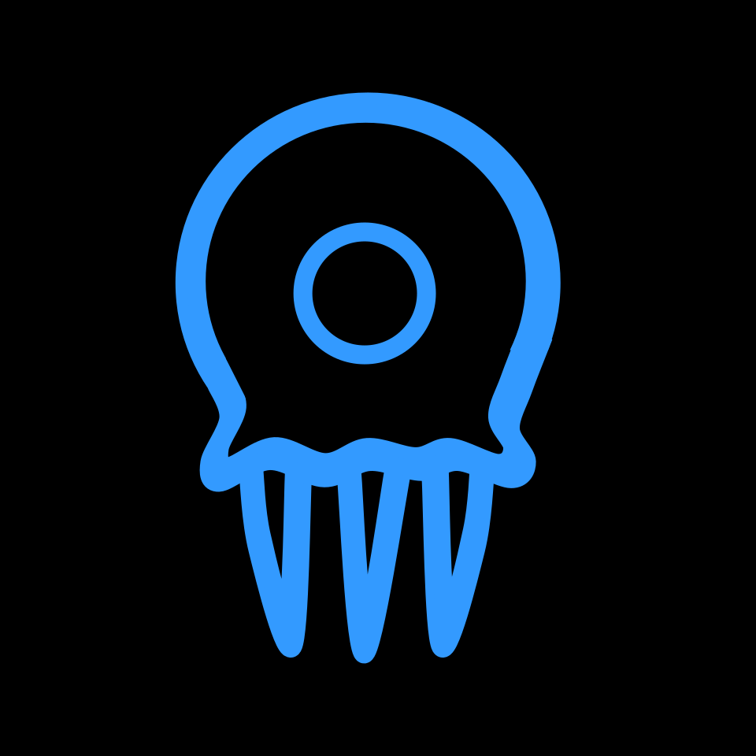

<h1 align="center">Fog Network</h1>

### About
We are dedicated to ending censorship
- Bypass Internet Filters
- Privacy Respecting
- Good Looking
- Open Source

### Projects
- [Tsunami](https://github.com/FogNetwork/Tsunami) - Proxy Site
- [Smoke](https://github.com/FogNetwork/Smoke) - Web Proxy
- [Rusty](https://github.com/FogNetwork/Rusty) - Frontend for Corrosion
- Avo.js - Bookmarklet

### Staff
- [Nebelung](https://github.com/Nebelung-Dev) - Owner of FN
- [EnderKingJ](https://github.com/EnderKingJ) - Creator of Smoke
